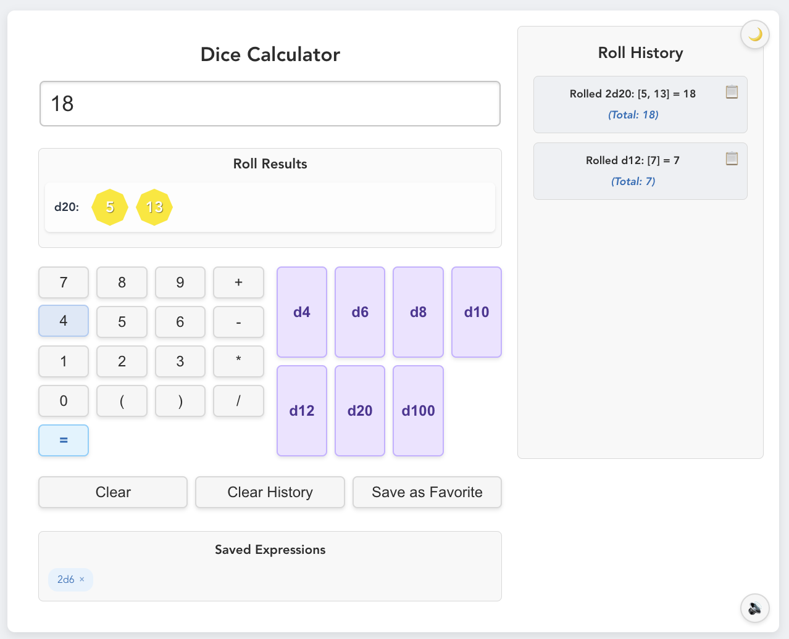
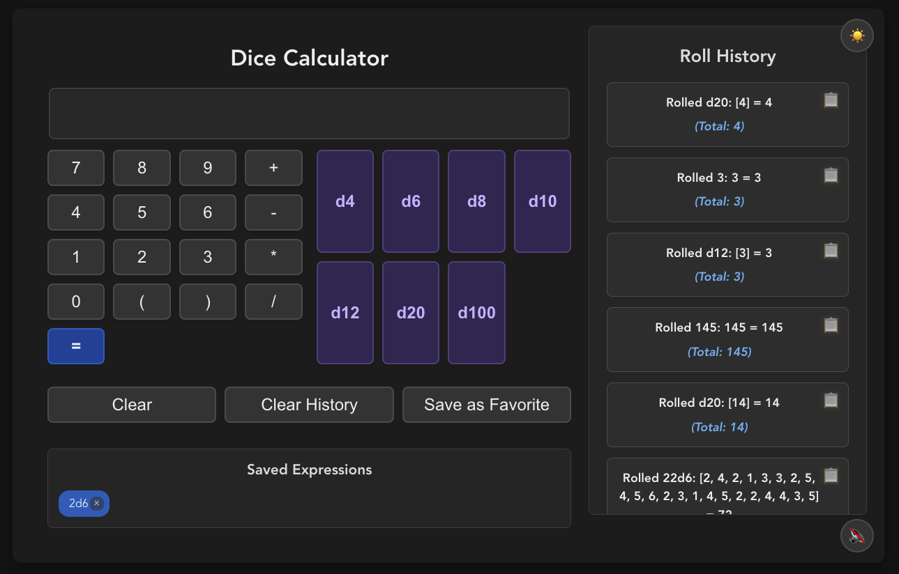

# Dice Rolling Calculator

A comprehensive dice rolling calculator built with Vue.js, designed for tabletop gaming enthusiasts. This application allows users to roll various types of dice with a clean, intuitive interface.

## Features

- **Dice Rolling**: Roll any combination of d4, d6, d8, d10, d12, d20, and d100 dice
- **Expression Support**: Calculate complex expressions with arithmetic operators (+, -, \*, /)
- **Roll History**: View a history of your dice rolls with detailed results
- **Visual Dice**: See a visual representation of your dice rolls
- **Saved Expressions**: Save frequently used dice expressions for quick access
- **Dark Mode**: Toggle between light and dark mode for comfortable use in any environment
- **Sound Effects**: Optional sound effects for dice rolling and button interactions
- **Keyboard Support**: Use keyboard shortcuts for faster dice rolling

## Screenshots

### Light Mode



### Dark Mode



## Usage

The calculator allows you to:

1. Click dice buttons (d4, d6, etc.) to add them to your expression
2. Use number keys and operators to create complex formulas
3. Press "=" or Enter to roll the dice and calculate the result
4. Save frequently used expressions with the "Save as Favorite" button
5. Toggle between light and dark mode with the sun/moon button
6. Enable/disable sound effects with the sound button

## Keyboard Shortcuts

- **Numbers 0-9**: Add numbers to the expression
- **+, -, \*, /**: Add operators to the expression
- **d + [number]**: Quickly add dice (e.g., press 'd' then '6' for d6)
- **Enter**: Roll dice / calculate result
- **Escape**: Clear the display
- **Backspace**: Delete the last character

## Project Setup

```
npm install
```

### Compiles and hot-reloads for development

```
npm run serve
```

### Compiles and minifies for production

```
npm run build
```

### Run your unit tests

```
npm run test:unit
```

### Lints and fixes files

```
npm run lint
```

## Technical Details

- Built with Vue.js 3 and TypeScript
- Uses the Web Audio API for custom sound effects
- Responsive design optimized for desktop use
- Comprehensive test suite for dice rolling logic
